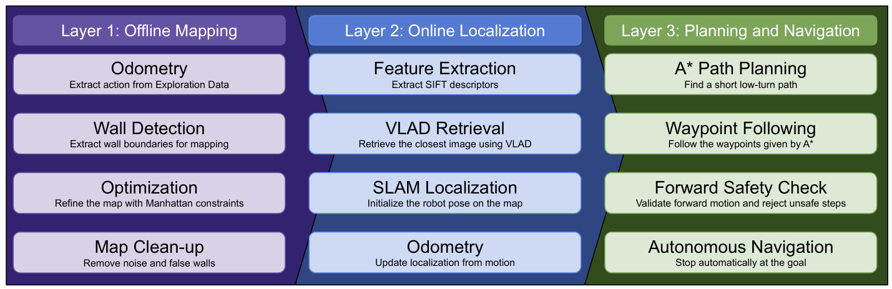
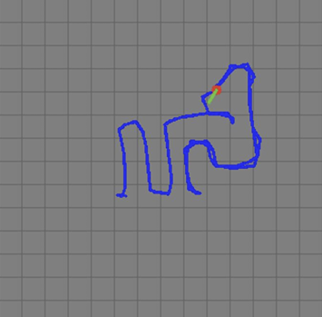
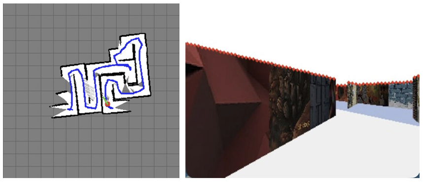
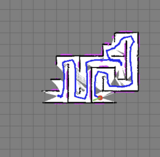
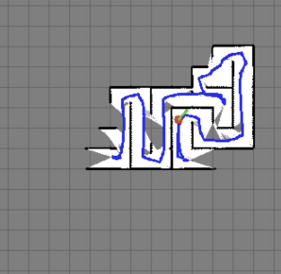
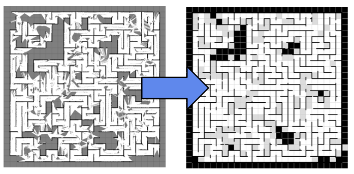
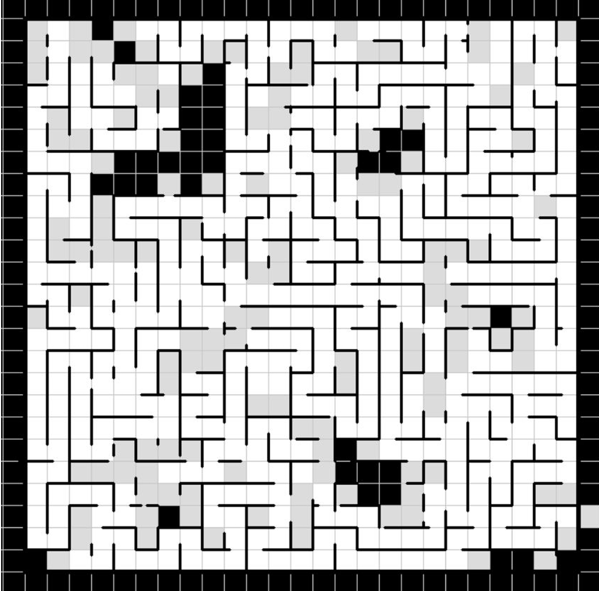
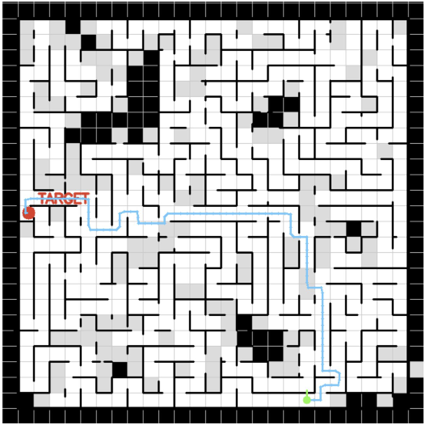

# Autonomous Maze Navigation Using Visual SLAM

This repository implements a visual-geometric navigation system for autonomous maze solving in the AI4CE Visual Navigation Game environment. Instead of navigating only by matching the current camera frame to the nearest exploration image, the system reconstructs a cleaned metric maze map from exploration data, localizes the robot on that map using visual retrieval and stored SLAM poses, plans a low-turn A* route to the target, and follows the route using a discrete stop-turn-move controller with map-based safety checks.

In the final big-maze demonstration, the robot reached the target with a best recorded translation error of **0.0511 m**, completing navigation in **1087 navigation steps** and **9.05 s**. The fastest run used map visualization turned off during navigation to reduce rendering overhead and optimize execution speed.

---

## Final result

| Metric | Best run |
|---|---:|
| Target reached | Yes |
| Translation error | **0.0511 m** |
| Navigation steps | **1087** |
| Completion time | **9.05 s** |
| Navigation mode | Autonomous |
| Fastest configuration | Map visualization off |

The repository also includes demo videos for the offline SLAM process and autonomous navigation with map visualization both enabled and disabled.

---

## Source platform

This project was built on top of the public AI4CE Visual Navigation Game player framework:

```text
https://github.com/ai4ce/vis_nav_player
```

The platform provides a simulated visual navigation environment where the robot receives exploration data before navigation and must later use a live first-person camera view to reach a target. The public baseline uses RootSIFT, K-Means visual vocabulary construction, VLAD encoding, a temporal/visual graph, and shortest-path planning over retrieved frames. This project keeps the visual retrieval idea but adds a metric mapping and control layer: offline visual-geometric SLAM, Manhattan-constrained map correction, cleaned occupancy-map generation, target refinement using epipolar geometry, direction-aware A* planning, and autonomous waypoint following.

---

## Repository structure

```text
├── offline_slam.py
├── cleanup.py
├── run.py
│
├── assets/
│   ├── 3_layer.png
│   ├── estimate_robot_pose_from_odometry.png
│   ├── extract_walls_and_open_spaces.png
│   ├── manhattan_constraint.png
│   ├── collision_detector.png
│   ├── clean_map.png
│   ├── final_map.png
│   ├── map_with_A_star_path.png
│   ├── offline_slam_demo.mp4
│   ├── navigation_with_map_visualization_on.mp4
│   └── navigation_with_map_visualization_off.mp4
│
└── README.md
```

Runtime files are generated locally under `cache/` after running the mapping and cleanup scripts. 

Expected runtime cache outputs include:

```text
cache/
├── slam_map.png
├── slam_walls.json
├── frame_poses.json
├── slam_map_walls_cleaned.png
├── sift_ss5.pkl
├── codebook_k128.pkl
└── astar_path_cache.pkl
```

---

## System overview

The system is organized as a three-layer visual navigation pipeline.



### Layer 1: Offline mapping

The offline mapping stage uses the recorded exploration trajectory to build a rough metric map. It converts exploration actions into odometry, detects wall boundaries from camera images, projects those wall observations into the world frame, corrects drift with Manhattan-world constraints, and exports raw wall points and frame poses for later cleanup.

### Layer 2: Online localization

During navigation, the first live camera frame is matched against the exploration image database using SIFT and VLAD. The best-matching exploration frame gives an initial pose estimate through the stored `frame_poses.json` map. The system then updates pose through odometry and periodically uses wall geometry to correct heading drift.

### Layer 3: Planning and navigation

The cleaned map is converted into free space and obstacles. A direction-aware A* planner searches for a safe route to the target while penalizing turns and cells near walls. The route is sparsified into waypoints, and a simple autonomous controller follows those waypoints using discrete actions: `LEFT`, `RIGHT`, and `FORWARD`.

---

## Method

### 1. Offline visual-geometric SLAM

`offline_slam.py` is the pre-navigation mapping engine. It processes the exploration dataset frame by frame and creates the raw SLAM map used by the rest of the system.

The mapping stage performs five main operations:

1. **Odometry from exploration actions**  
   Raw actions such as `FORWARD`, `LEFT`, `RIGHT`, and `BACKWARD` are converted into linear and angular velocities. These are integrated over time to estimate the robot pose `(x, y, yaw)`.

   

2. **Wall and open-space extraction**  
   The camera image is thresholded to isolate the bright sky region. The top sky-wall boundary is treated as the visible top edge of the wall. Using a pinhole camera model, these image pixels are back-projected into local 2D wall points and open-space rays.

   

3. **Manhattan-world correction**  
   Since the maze is grid-like, wall directions should mostly align with 90-degree axes. A histogram voting system finds the dominant wall direction in the current frame. The robot heading and position are softly corrected by snapping wall observations toward the nearest Manhattan direction and the nearest 0.4 m grid line.

   

4. **Visual stuck and collision detection**  
   Consecutive frames are compared to detect non-ideal movement. The system uses `cv2.phaseCorrelate` with a Hann window to estimate image shift and `cv2.absdiff` to detect whether the scene is changing. This helps identify sliding, blocked rotation, or stuck behavior that would otherwise corrupt odometry.

   

5. **Raw map export**  
   The SLAM stage writes the raw occupancy visualization, surviving wall points, and frame-to-pose lookup table to `cache/`.

Generated files:

```text
cache/slam_map.png
cache/slam_walls.json
cache/frame_poses.json
```

---

## 2. Map cleanup

`cleanup.py` converts noisy SLAM output into a clean maze map that can be used for planning.

The cleanup stage:

- Loads raw wall coordinates from `cache/slam_walls.json`.
- Groups noisy points into grid-aligned wall candidates.
- Keeps only wall segments with enough evidence.
- Removes wall segments that the robot trajectory clearly passed through.
- Builds a discrete occupancy-style map with three cell categories:
  - **White:** confirmed open space observed by the robot.
  - **Gray:** uncertain space with insufficient evidence.
  - **Black:** unexplored or wall-like region.
- Saves the final cleaned map as `cache/slam_map_walls_cleaned.png`.



The final cleaned maze map is the main navigation map used by the planner.



---

## 3. Online localization and target estimation

`run.py` is the main challenge-time navigation file. It handles visual localization, target estimation, A* planning, waypoint following, map visualization, and autonomous control.

The localization pipeline uses:

- **SIFT descriptors** for local visual features.
- **RootSIFT normalization** for more stable matching.
- **K-Means** to build a visual vocabulary.
- **VLAD encoding** to convert each exploration image into a compact global descriptor.
- **Cosine similarity** between the live FPV descriptor and the exploration database to initialize the robot pose.

The target view is also matched against the exploration database. After the best target frame is found, the system optionally computes an essential matrix using matched SIFT features. This gives a relative pose estimate between the target image and the matched exploration frame. Because the essential matrix provides translation only up to scale, the system estimates scale using wall-depth information from the camera geometry, then refines the target location in the metric map.

---

## 4. Direction-aware A* path planning

The cleaned map is converted into a free-space mask. The planner erodes the free space slightly to add a safety margin near walls, then uses a distance transform to estimate clearance. A* is run directly on the cleaned map image.

Unlike a plain shortest-path planner, this A* search includes:

- **4-connected motion** to avoid unrealistic diagonal corner-cutting.
- **Turn penalty** so the path prefers fewer turns.
- **Wall penalty** so cells close to walls become more expensive.
- **Path sparsification** so the controller follows smooth waypoints instead of every pixel step.
- **Caching** so repeated start-goal searches can reuse the previous path.



This makes the selected route easier for the robot to follow than a purely geometric shortest path.

---

## 5. Autonomous control

The controller follows the planned A* route waypoint by waypoint.

At each step, it:

1. Selects the next useful waypoint.
2. Computes the angle from the robot pose to that waypoint.
3. Compares the target angle with the current heading.
4. Turns left or right if the heading error is too large.
5. Moves forward once aligned.
6. Checks whether the robot has reached the final path endpoint or the refined target.
7. Sends `CHECKIN` automatically at the goal.

The controller intentionally uses a simple stop-turn-move policy. It does not move diagonally and does not rotate while moving forward. This makes the robot slower than a continuous controller, but much more stable in narrow maze corridors.

---

## Demo videos

The repository stores all media in `assets/`.

| Video | Description |
|---|---|
| `assets/offline_slam_demo.mp4` | Shows the map being constructed from exploration images during the offline SLAM stage. |
| `assets/navigation_with_map_visualization_on.mp4` | Shows autonomous navigation with the live map visualization enabled. This is useful for debugging but slower because of rendering overhead. |
| `assets/navigation_with_map_visualization_off.mp4` | Shows autonomous navigation with map visualization disabled. This is the speed-optimized configuration used for the fastest run. |

---

## Software components

### `offline_slam.py`

The offline mapping script. It takes recorded exploration actions and images, estimates robot pose using odometry, extracts wall geometry using a pinhole camera model, applies Manhattan-world correction, detects abnormal movement, and exports raw wall points and frame poses.

Key classes:

| Class | Purpose |
|---|---|
| `Odometry` | Integrates linear and angular velocity into a global robot pose. |
| `WallDetector` | Extracts local wall and open-space points from FPV images. |
| `MapBuilder` | Builds the raw 2D map, raycasts open space, and stores frame poses. |
| `ManhattanConstraint` | Corrects heading and position drift using grid-aligned wall structure. |
| `VisualStuckDetector` | Detects sliding, blocked rotation, and stuck motion from frame differences. |

### `cleanup.py`

The map post-processing script. It converts noisy raw wall points into a clean discrete maze map by grouping wall evidence into grid segments, removing false walls crossed by the robot trajectory, and rendering a final occupancy-style image.

Key outputs:

```text
cache/slam_map_walls_cleaned.png
```

### `run.py`

The main autonomous navigation script. It builds the SIFT/VLAD image database, initializes localization from live FPV, estimates the goal location, plans a direction-aware A* route, and controls the robot until it reaches the target.

Key components:

| Component | Purpose |
|---|---|
| `VLADExtractor` | Builds the visual vocabulary and global image descriptors. |
| `KeyboardPlayerPyGame` | Main player class for localization, planning, visualization, and control. |
| `plan_astar_path()` | Computes a low-turn, wall-aware A* path on the cleaned map. |
| `get_autonomous_action()` | Converts the planned route into discrete robot actions. |
| `display_global_map()` | Shows the live pose, goal, and A* path on the cleaned maze map. |

---

## Installation

First install the Visual Navigation Game environment from the AI4CE repository:

```bash
git clone https://github.com/ai4ce/vis_nav_player.git
cd vis_nav_player
conda env create -f environment.yaml
conda activate game
```

Then place this repository's files into the player environment or run them from the same project root where `vis_nav_game` and the exploration data are available.

The Python scripts require:

```text
opencv-python
numpy
pygame
networkx
scikit-learn
tqdm
```

If needed, install the extra packages manually:

```bash
pip install opencv-python numpy pygame networkx scikit-learn tqdm
```

---

## Data layout

The scripts expect the exploration data under:

```text
data/traj_0/
├── data_info.json
└── image files
```

The `data_info.json` file stores the exploration sequence, including the robot action and image file for each recorded step.

The repository does not include the exploration dataset or generated cache files. They should be downloaded or generated locally.

---

## Running the system

### 1. Run offline SLAM

```bash
python offline_slam.py
```

This generates:

```text
cache/slam_map.png
cache/slam_walls.json
cache/frame_poses.json
```

### 2. Clean the map

```bash
python cleanup.py
```

This generates:

```text
cache/slam_map_walls_cleaned.png
```

### 3. Run autonomous navigation with visualization

```bash
python run.py --viz 1
```

This mode shows the live FPV view and the global metric map with the robot pose, target, and A* path. It is best for debugging and demonstration.

### 4. Run autonomous navigation without map visualization

```bash
python run.py --viz 0
```

This mode disables the map visualization and is better for speed. The best big-maze run used this configuration.

Optional navigation arguments:

```bash
python run.py --subsample 5 --n-clusters 128 --top-k 30 --viz 0
```

| Argument | Meaning |
|---|---|
| `--subsample` | Uses every Nth exploration frame for the visual database. |
| `--n-clusters` | VLAD visual vocabulary size. |
| `--top-k` | Number of global visual shortcut edges. |
| `--viz` | Enables or disables map visualization. |

---

## Why this approach works

The main challenge is that maze corridors often look visually similar. A pure visual nearest-neighbor method can localize to the wrong corridor, especially when different parts of the maze have similar textures or viewpoints.

This system reduces that failure mode by combining visual recognition with geometric structure:

- Visual matching provides an initial place estimate.
- Offline SLAM gives each exploration image a metric pose.
- Manhattan constraints exploit the grid-like maze geometry.
- Map cleanup removes false wall detections and converts noisy SLAM into a usable navigation map.
- A* planning chooses a route through free space rather than simply following visually similar frames.
- Turn and wall penalties produce routes that are easier and safer to follow.
- The controller checks the map before committing to forward movement.

The result is a more stable navigation pipeline than direct image-retrieval-only control.

---

## Limitations and lessons learned

This system worked well on the big maze, but several limitations remain:

- The SLAM map depends on accurate action timing and simulation parameters.
- The Manhattan-world assumption is useful for grid mazes but would be less reliable in curved or irregular environments.
- Visual localization can still fail if the current FPV frame is visually ambiguous or poorly matched to the exploration set.
- The controller uses discrete stop-turn-move actions, so it is stable but not as smooth as a continuous controller.
- Map visualization is useful for debugging but adds overhead, which is why the fastest run disables it.
- The generated cache files are environment- and run-specific, so they should be regenerated when the maze, exploration data, or parameters change.

---

## Final summary

This project demonstrates a complete visual navigation pipeline for maze solving: offline visual-geometric SLAM, wall extraction from camera images, Manhattan-constrained map correction, map cleanup, SIFT/VLAD localization, target refinement with epipolar geometry, direction-aware A* planning, and autonomous waypoint following. On the big maze, the final system reached the target with **0.0511 m translation error** in **1087 navigation steps** and **9.05 s**, showing that combining visual retrieval with geometric mapping and path planning is more reliable than relying on nearest-image matching alone.
